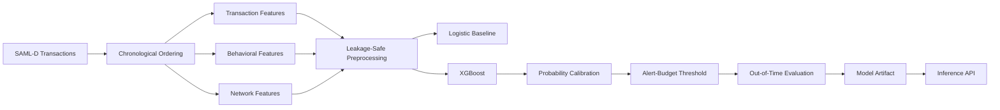

<div align="center">

# Quantitative Transaction Risk Modeling

**A research-grade framework for rare-event financial transaction surveillance using temporal, behavioral, and network signals.**

[](https://www.python.org/)
[](LICENSE)
[](#)
[](https://github.com/psf/black)
[](#contributing)

`Python` · `XGBoost` · `scikit-learn` · `DuckDB` · `SHAP` · `Flask`

[Overview](#overview) •
[Research Design](#research-design) •
[Quick Start](#quick-start) •
[API](#inference-api) •
[Results](#results) •
[Contributing](#contributing)

</div>

---

## Overview

**Quantitative Transaction Risk Modeling** is an end-to-end framework for modeling rare suspicious activity in high-volume financial transaction data. It is built as a research artifact first and a production prototype second — every design choice is made to keep the evaluation honest under severe class imbalance and realistic operational constraints.

**Research question:**

> Can historical transaction behavior, temporal dynamics, and network structure improve the identification of rare suspicious transactions under a constrained investigation budget?

The framework is validated on the **SAML-D** synthetic transaction dataset — approximately **9.5 million transactions** with a suspicious-event rate of roughly **0.1%** — and emphasizes:

- Strict chronological development (no shuffling, no lookahead)
- Leakage-aware historical feature construction
- Probability calibration, not just raw model scores
- Alert-budget–constrained decision thresholds
- Out-of-time evaluation on a held-out future window
- Reproducible, versioned inference artifacts

## Why This Exists

Most fraud/AML tutorials optimize ROC-AUC on a random train/test split and call it done. That approach silently leaks the future into the past and produces metrics that don't survive contact with a real compliance team, who can only investigate a fixed number of alerts per day. This project is an attempt to do it properly: chronological splits, calibrated probabilities, and evaluation metrics chosen because they hold up under a ~0.1% base rate and a fixed alert budget.

## Research Design

Transaction surveillance is treated as a **ranking and decision problem**, not a plain classification problem. For transaction $i$, the model estimates:

$$
P(Y_i = 1 \mid X_i)
$$

where $Y_i = 1$ denotes suspicious activity and $X_i$ contains only information available *before* the transaction occurs.



Historical variables use windows ending strictly before the current transaction. The dataset is split chronologically into **70% training**, **15% validation/calibration**, and **15% untouched out-of-time test** data — the test period is never seen during feature fitting, calibration, or threshold selection.

## Feature Engineering

| Group | Examples |
| --- | --- |
| **Transaction** | amount, log amount, cyclical time-of-day, weekend/night indicators, currency mismatch, geographic mismatch, round-amount flags |
| **Behavioral** | rolling sender/receiver activity, currency-aware amount statistics, account-relative z-scores, time since previous sender transaction, historical sender–receiver interaction counts |
| **Network** | historical transaction counts, unique counterparties, pair frequency, sender counterparty concentration |

Network features treat accounts as nodes and transactions as directed edges. Counterparty concentration is measured with a Herfindahl–Hirschman-style index:

$$
HHI_i = \sum_j p_{ij}^{2}
$$

where $p_{ij}$ is the fraction of a sender's historical transfer value sent to counterparty $j$.

## Modeling & Evaluation

A regularized logistic classifier provides an interpretable linear benchmark. **XGBoost** is the primary nonlinear model, trained with class weighting to account for the rarity of the positive class.

Because the event rate is ~0.1%, evaluation deliberately avoids metrics that look good by default under imbalance:

| Metric | Purpose |
| --- | --- |
| PR-AUC | Rare-event ranking quality |
| ROC-AUC | Overall discrimination |
| Brier score | Probability calibration |
| Log loss | Probabilistic accuracy |
| Precision@K | Suspicious share within the alert budget |
| Recall@K | Suspicious activity captured within the alert budget |
| Lift@K | Concentration relative to the base rate |

Feature-ablation experiments compare **transaction-only**, **transaction + behavioral**, **transaction + network**, and **full feature** sets on identical chronological partitions, so the marginal value of behavioral and network signal can be measured directly rather than assumed.

## Results

> Fill this section in with the numbers from your latest `reports/` run before publishing — reviewers look here first.

| Feature Set | PR-AUC | Precision@1% | Recall@1% | Lift@1% |
| --- | --- | --- | --- | --- |
| Transaction-only | — | — | — | — |
| + Behavioral | — | — | — | — |
| + Network | — | — | — | — |
| Full | — | — | — | — |

## Repository Structure

```text
Quantitative-Transaction-Risk-Modeling/
├── artifacts/              # Saved model artifacts (preprocessor, model, calibrator, metadata)
├── data/                   # Raw and processed data (gitignored beyond samples)
├── docs/assets/             # Diagrams, plots, and images used in documentation
├── reports/                 # Evaluation reports and ablation results
├── scripts/
│   ├── build_features.py    # Chronological, leakage-safe feature construction
│   ├── feature_ablation.py  # Transaction / behavioral / network ablation study
│   └── train_model.py       # Training, calibration, threshold selection, evaluation
├── src/
│   ├── api/app.py           # Flask inference API
│   ├── data/loader.py       # Raw data loading utilities
│   ├── evaluation/           # Metrics and evaluation harness
│   ├── features/              # Feature engineering modules
│   └── models/                # Model wrappers and calibration logic
├── tests/                    # Unit and integration tests
├── README.md
├── pyproject.toml
└── requirements.txt
```

## Quick Start

### Prerequisites

- Python 3.11+
- ~4 GB free disk space for the SAML-D dataset and derived features
### Installation

```bash
git clone https://github.com/<your-username>/Quantitative-Transaction-Risk-Modeling.git
cd Quantitative-Transaction-Risk-Modeling

python3 -m venv venv
source venv/bin/activate          # Windows: venv\Scripts\activate
pip install --upgrade pip
pip install -r requirements.txt
```

### Run the pipeline

Download the [SAML-D dataset](https://www.kaggle.com/datasets/berkanoztas/synthetic-transaction-monitoring-dataset-aml) and place it at `data/raw/SAML-D.csv`, then:

```bash
venv/bin/python scripts/build_features.py     # chronological, leakage-safe features
venv/bin/python scripts/train_model.py        # train, calibrate, select threshold, evaluate
venv/bin/python scripts/feature_ablation.py   # transaction vs. behavioral vs. network study
venv/bin/python -m pytest -v                  # run the test suite
```

`train_model.py` fits preprocessing on the training period only, calibrates validation probabilities, selects an alert-budget threshold, evaluates the untouched out-of-time test period, benchmarks against the logistic baseline, and writes `artifacts/risk_model.joblib`.

## Inference API

The saved artifact bundles the preprocessor, XGBoost model, probability calibrator, feature contract, decision threshold, evaluation metrics, and reproducibility metadata into a single versioned object.

```bash
venv/bin/python -m src.api.app
```

| Method | Endpoint | Description |
| --- | --- | --- |
| `GET` | `/api/health` | Service and model health check |
| `GET` | `/api/model/info` | Model metadata, feature contract, and evaluation metrics |
| `POST` | `/api/predict` | Calibrated transaction-risk inference |

<details>
<summary><strong>Example request/response</strong></summary>

```bash
curl -X POST http://localhost:5000/api/predict \
  -H "Content-Type: application/json" \
  -d '{
        "amount": 15230.50,
        "sender_id": "ACC-10245",
        "receiver_id": "ACC-88213",
        "currency": "USD",
        "timestamp": "2026-08-28T14:32:00Z"
      }'
```

```json
{
  "risk_score": 0.0421,
  "flagged": false,
  "threshold": 0.0387,
  "model_version": "2026-08-01"
}
```

</details>

> **Note:** The API expects the engineered feature schema used during training. Historical behavioral variables must be supplied by an upstream feature store rather than reconstructed from a single raw transaction.

## Reproducibility

- Preprocessing is fitted using training observations only.
- Historical windows exclude the current transaction (no lookahead).
- Currency-specific amount statistics avoid mixing incomparable nominal values.
- Final evaluation preserves natural rare-event prevalence — no oversampling of the test set.
- Calibration and operational threshold selection are kept separate from final testing.
- The saved artifact records training dates, class prevalence, model hyperparameters, package versions, and compact validation probability quantiles for drift monitoring.

## Roadmap

- [ ] Streaming/online feature computation for near-real-time scoring
- [ ] Graph neural network baseline for the network-feature branch
- [ ] Model card and datasheet for the released artifact
- [ ] Dockerized inference service

## Contributing

Contributions are welcome. Please:

1. Open an issue describing the change before large PRs.
2. Run `pytest` and `black .` before submitting.
3. Keep new features leakage-safe — anything derived from data must respect the chronological cutoff.

See [`CONTRIBUTING.md`](CONTRIBUTING.md) for the full guide.

## Citation

If you use this framework or the accompanying analysis, please cite:

```bibtex
@software{quant_transaction_risk_modeling,
  title  = {Quantitative Transaction Risk Modeling},
  author = {<Your Name>},
  year   = {2026},
  url    = {https://github.com/<your-username>/Quantitative-Transaction-Risk-Modeling}
}
```

## Dataset Reference

This project uses the **Synthetic Anti-Money Laundering Dataset (SAML-D)**:

B. Oztas, D. Cetinkaya, F. Adedoyin, M. Budka, H. Dogan, and G. Aksu, "Enhancing Anti-Money Laundering: Development of a Synthetic Transaction Monitoring Dataset," *2023 IEEE International Conference on e-Business Engineering (ICEBE)*.

## License

Distributed under the [MIT License](LICENSE).

---

<div align="center">

Built by [Your Name](https://github.com/<your-username>) — feedback and issues welcome.

</div>