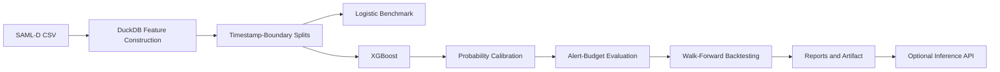

<div align="center">

# Quantitative Transaction Risk Modeling

### A research-oriented framework for rare-event financial transaction surveillance using temporal, behavioral, and network signals.

**Python · XGBoost · scikit-learn · DuckDB · SHAP · Flask**

</div>

## Research Question

Can historical transaction behavior, temporal dynamics, and network structure improve the identification of rare suspicious transactions under a constrained investigation budget, and does that improvement remain stable out of time?

The framework uses the synthetic SAML-D dataset, containing approximately 9.5 million transactions with a suspicious-event rate of roughly 0.1%. It treats surveillance as a ranking and decision problem rather than a conventional balanced classification task.

For transaction $i$, the model estimates:

$$
P(Y_i = 1 \mid X_i)
$$

where $X_i$ contains only information available before the transaction occurs.

## Workflow



Historical windows terminate strictly before the current transaction. Preprocessing is fitted on training data only, while the final test period preserves the natural class prevalence.

## Features

- **Transaction:** amount, log amount, cyclical time, weekend/night indicators, currency mismatch, geographic mismatch, and round amounts.
- **Behavioral:** currency-aware rolling sender/receiver activity, account-relative z-scores, time since the previous sender transaction, and historical pair frequency.
- **Network:** lifetime transaction counts, unique counterparties, pair frequency, and sender counterparty concentration using an HHI-style measure.

$$
HHI_i = \sum_j p_{ij}^{2}
$$

Here $p_{ij}$ is the fraction of a sender's historical transfer value sent to counterparty $j$.

## Evaluation

The project reports PR-AUC, ROC-AUC, Brier score, log loss, precision, recall, and lift at explicit alert budgets including 0.1%, 0.5%, and 1.0%. Alert metrics select exactly the top-$K$ ranked transactions, including when probabilities tie.

Feature ablation compares transaction-only, transaction plus behavioral, transaction plus network, and full feature sets. Walk-forward evaluation measures whether performance is stable across future periods. Generated results are written to `reports/` after a dataset-backed run.

## Repository Structure

```text
Quantitative-Transaction-Risk-Modeling/
├── artifacts/
├── data/
├── docs/assets/
├── reports/
├── scripts/
│   ├── build_features.py
│   ├── feature_ablation.py
│   ├── run_experiments.py
│   ├── train_model.py
│   └── walk_forward_backtest.py
├── src/
│   ├── api/app.py
│   ├── data/
│   ├── evaluation/
│   ├── features/
│   └── models/
├── tests/
├── README.md
├── pyproject.toml
└── requirements.txt
```

<<<<<<< HEAD
## Quick Start

### Prerequisites

- Python 3.11+
- ~4 GB free disk space for the SAML-D dataset and derived features
### Installation
=======
## Reproduction
>>>>>>> c691e60 (feat: update project version and dependencies; enhance feature building and model training scripts)

```bash
git clone https://github.com/Samarthuday/Quantitative-Transaction-Risk-Modeling.git
cd Quantitative-Transaction-Risk-Modeling
python3 -m venv venv
source venv/bin/activate
pip install -e ".[dev]"
```

Obtain SAML-D separately and place it at `data/raw/SAML-D.csv`, then run the complete workflow:

```bash
venv/bin/python scripts/run_experiments.py
venv/bin/python -m pytest -v
```

For a development smoke run using a small feature file:

```bash
venv/bin/python scripts/train_model.py --features data/processed/features.parquet --fast
```

The workflow produces `data/processed/transactions_features.parquet`, `artifacts/risk_model.joblib`, `reports/model_metrics.json`, `reports/ablation_results.csv`, and `reports/walk_forward_results.csv`.

## Optional Inference Interface

The Flask service scores precomputed feature vectors with the serialized preprocessor, model, and calibrator:

```bash
venv/bin/python -m src.api.app
```

| Method | Endpoint | Description |
| --- | --- | --- |
| GET | `/api/health` | Service and model health |
| GET | `/api/model/info` | Model metadata and evaluation metrics |
| POST | `/api/predict` | Calibrated probability for a feature vector |

Online historical feature computation is outside the current research scope. The API does not accept raw account identifiers or reconstruct behavioral history from a single transaction.

## Limitations

- SAML-D is synthetic; results do not establish performance at real financial institutions.
- Historical relationships may differ in real transaction networks.
- No causal interpretation is claimed.
- Calibration may drift under distribution shift.
- Risk probabilities are model estimates, not financial-loss probabilities.
- The online feature-store layer is outside the current research scope.

## Dataset Reference

B. Oztas, D. Cetinkaya, F. Adedoyin, M. Budka, H. Dogan and G. Aksu, “Enhancing Anti-Money Laundering: Development of a Synthetic Transaction Monitoring Dataset,” 2023 IEEE International Conference on e-Business Engineering (ICEBE).
