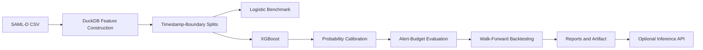
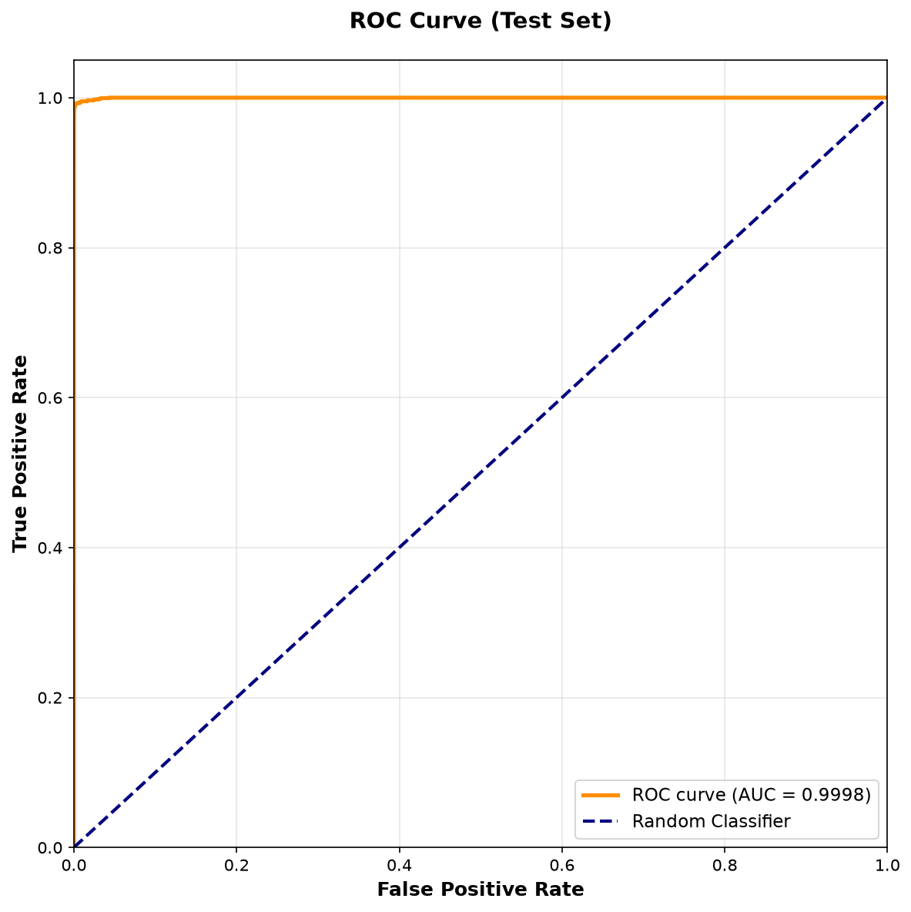
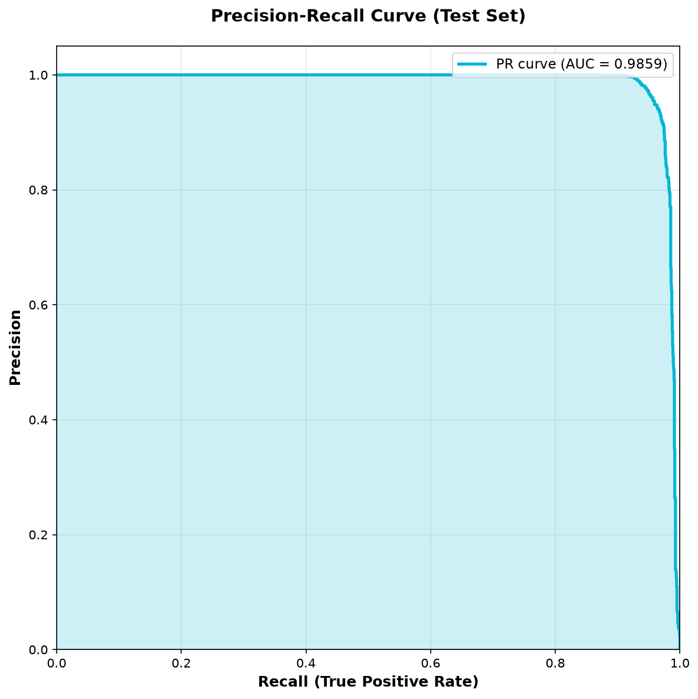
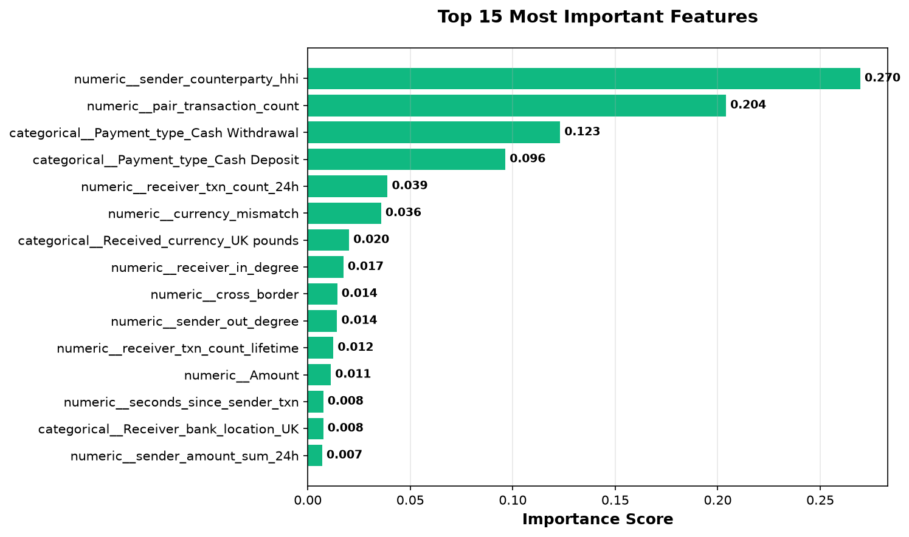
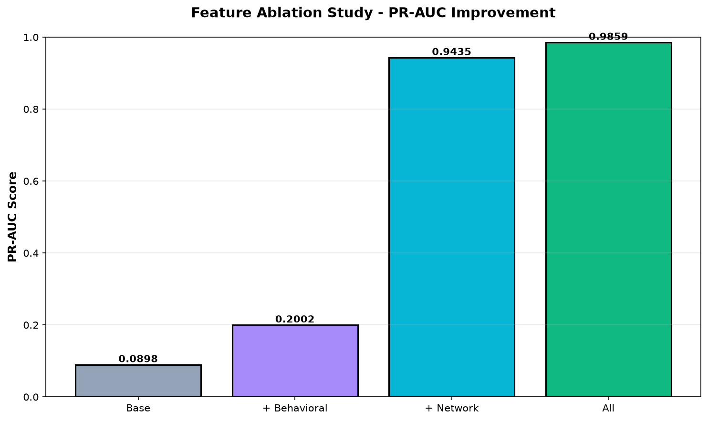
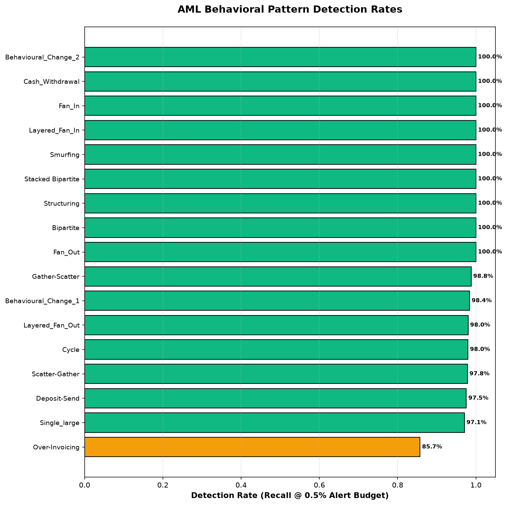
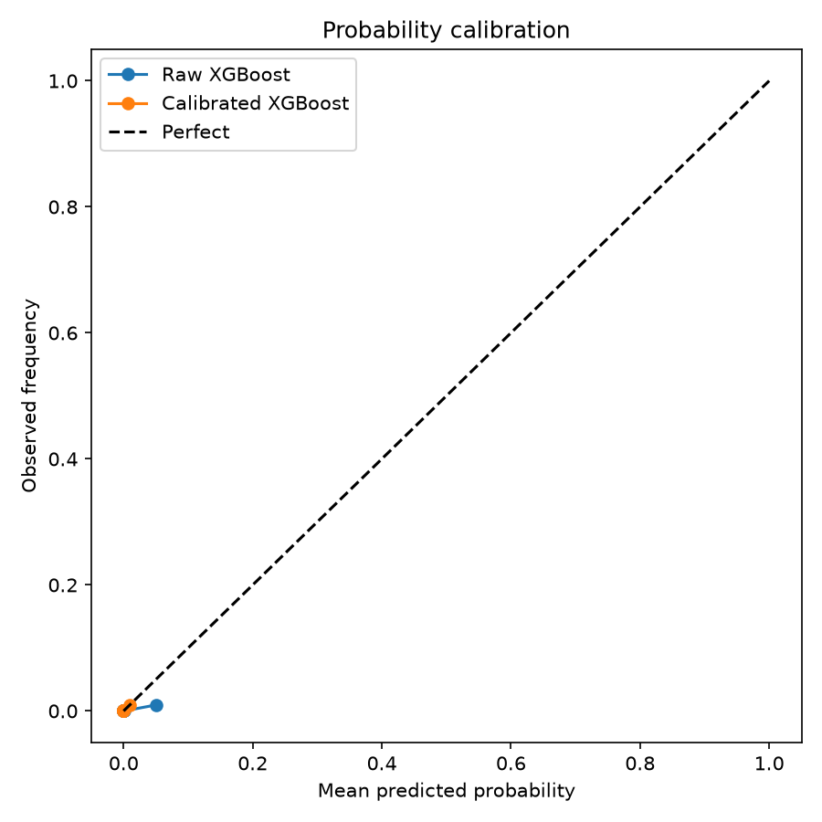

<div align="center">

# Quantitative Transaction Risk Modeling

### A research-oriented framework for rare-event financial transaction surveillance using temporal, behavioral, and network signals.

**Python · XGBoost · scikit-learn · DuckDB · SHAP · FastAPI**

</div>

## Research Question

Can historical transaction behavior, temporal dynamics, and network structure improve the identification of rare suspicious transactions under a constrained investigation budget, and does that improvement remain stable out of time?

The framework uses the synthetic SAML-D dataset, containing approximately 9.5 million transactions with a suspicious-event rate of roughly 0.1%. It treats surveillance as a ranking and decision problem rather than a conventional balanced classification task.

For transaction $i$, the model estimates:

$$
P(Y_i = 1 \mid X_i)
$$

where $X_i$ contains only information available before the transaction occurs.

## Workflow



Historical windows terminate strictly before the current transaction. Preprocessing is fitted on training data only, while the final test period preserves the natural class prevalence.

## Features

- **Transaction:** amount, log amount, cyclical time, weekend/night indicators, currency mismatch, geographic mismatch, and round amounts.
- **Behavioral:** currency-aware rolling sender/receiver activity, account-relative z-scores, time since the previous sender transaction, and historical pair frequency.
- **Network:** lifetime transaction counts, unique counterparties, pair frequency, and sender counterparty concentration using an HHI-style measure.

$$
HHI_i = \sum_j p_{ij}^{2}
$$

Here $p_{ij}$ is the fraction of a sender's historical transfer value sent to counterparty $j$.

## Evaluation

The project reports PR-AUC, ROC-AUC, Brier score, log loss, precision, recall, and lift at explicit alert budgets including 0.1%, 0.5%, and 1.0%. Alert metrics select exactly the top-$K$ ranked transactions, including when probabilities tie.

Feature ablation compares transaction-only, transaction plus behavioral, transaction plus network, and full feature sets. Walk-forward evaluation measures whether performance is stable across future periods. Generated results are written to `reports/` after a dataset-backed run.

## Results

The model was trained and evaluated on the SAML-D dataset (9.5M transactions, synthetic). Below are the key metrics from the full pipeline run:

### Performance Metrics

| Metric | Score |
|--------|-------|
| **PR-AUC** | **0.9859** |
| **ROC-AUC** | **0.9998** |
| Brier Score | 0.0001 |
| Log Loss | 0.0004 |
| Precision @ 0.1% alert rate | 100% |
| Recall @ 0.1% alert rate | 83.9% |
| Lift @ 0.1% alert rate | **838.8x** |

### Feature Ablation Results

Model performance improves dramatically as feature categories are added:

| Feature Set | PR-AUC | Recall @ 0.5% |
|---|---|---|
| Base (transaction features only) | 0.0898 | 12.9% |
| + Behavioral (activity patterns) | 0.2002 | 45.2% |
| + Network (graph concentration) | **0.9435** | **97.7%** |
| All (+ categorical) | **0.9859** | **99.3%** |

Network features provide the most significant lift (0.0898 → 0.9435), indicating that transaction graph structure is critical for AML detection.

### Behavioral Typology Detection

The model detects specific money-laundering patterns with high recall:

- **100% detection**: Structuring, Smurfing, Cash Withdrawal, Fan-In, Layered Fan-In, Fan-Out, Bipartite
- **98%+ detection**: Behavioural Change, Cycle, Deposit-Send, Scatter-Gather, Gather-Scatter, Stacked Bipartite, Single Large
- **Limitations**: Over-Invoicing (86% recall) detected less reliably due to low transaction prevalence

### Analysis Visualizations













## Repository Structure

```text
Quantitative-Transaction-Risk-Modeling/
├── artifacts/
├── data/
│   ├── raw/
│   └── processed/
├── docs/
│   └── assets/           # Committed model outputs, figures, metrics
├── public/               # Frontend SPA (HTML/CSS/JS)
├── reports/
│   ├── figures/          # Generated visualization PNGs
│   ├── ablation_results.csv
│   ├── typology_results.csv
│   └── model_metrics.json
├── scripts/
│   ├── build_features.py
│   ├── feature_ablation.py
│   ├── generate_report_figures.py
│   ├── run_experiments.py
│   ├── train_model.py
│   └── walk_forward_backtest.py
├── src/
│   ├── api/
│   │   ├── main.py       # FastAPI application
│   │   ├── models.py     # Pydantic request/response models
│   │   ├── inference.py  # Async inference layer
│   │   └── results_loader.py
│   ├── data/
│   ├── evaluation/
│   ├── features/
│   └── models/
├── tests/
├── README.md
├── pyproject.toml
└── requirements.txt
```

## Quick Start & Reproduction

### Prerequisites

- Python 3.11+
- ~4 GB free disk space for the SAML-D dataset and derived features

### Installation

```bash
git clone https://github.com/Samarthuday/Quantitative-Transaction-Risk-Modeling.git
cd Quantitative-Transaction-Risk-Modeling
python3 -m venv venv
source venv/bin/activate
pip install -e ".[dev]"
```

Obtain SAML-D separately and place it at `data/raw/SAML-D.csv`, then run the complete workflow:

```bash
venv/bin/python scripts/run_experiments.py
venv/bin/python -m pytest -v
```

For a development smoke run using a small feature file:

```bash
venv/bin/python scripts/train_model.py --features data/processed/features.parquet --fast
```

The workflow produces `data/processed/transactions_features.parquet`, `artifacts/risk_model.joblib`, `reports/model_metrics.json`, `reports/ablation_results.csv`, and `reports/walk_forward_results.csv`.

## Optional Inference Interface

The FastAPI service scores precomputed feature vectors with the serialized preprocessor, model, and calibrator. It includes an interactive dashboard displaying model metrics, analysis charts, feature ablation, and behavioral typology detection rates.

### Starting the Server

```bash
uvicorn src.api.main:app --host 0.0.0.0 --port 8000
```

Open `http://localhost:8000` in your browser to see the dashboard with all analysis visualizations.

### API Endpoints

| Method | Endpoint | Description |
| --- | --- | --- |
| GET | `/` | Interactive dashboard (SPA) |
| GET | `/api/health` | Service and model health |
| GET | `/api/model/info` | Model metadata and evaluation metrics |
| GET | `/api/results` | Analysis results (ablation, typology, figures as base64) |
| POST | `/api/predict` | Calibrated probability for a feature vector |

### Example: Score a Transaction

```bash
curl -X POST http://localhost:8000/api/predict \
  -H "Content-Type: application/json" \
  -d '{
    "Amount": 1000.0,
    "log_amount": 6.908,
    "hour_sin": 0.5,
    "hour_cos": 0.866,
    ...
  }'
```

**Response:**
```json
{
  "risk_probability": 0.0002,
  "requires_review": false,
  "risk_percentile": 98.9
}
```

### Dashboard Features

- **Overview tab**: Key metrics (PR-AUC, ROC-AUC, alert threshold, model status)
- **Analysis Charts tab**: ROC curve, Precision-Recall curve, feature importance, ablation comparison, typology detection, calibration curve
- **Feature Ablation tab**: Performance improvement as feature categories are added
- **Behavioral Typology tab**: Detection rates for 27 AML patterns with search/filter
- **Provenance tab**: Dataset size (9.5M transactions), model version, training metadata
- **Dark mode**: Toggle in header, saved to localStorage

**Note:** Online historical feature computation is outside the current research scope. The API does not accept raw account identifiers or reconstruct behavioral history from a single transaction.

## Limitations

- SAML-D is synthetic; results do not establish performance at real financial institutions.
- Historical relationships may differ in real transaction networks.
- No causal interpretation is claimed.
- Calibration may drift under distribution shift.
- Risk probabilities are model estimates, not financial-loss probabilities.
- The online feature-store layer is outside the current research scope.

## Dataset Reference

B. Oztas, D. Cetinkaya, F. Adedoyin, M. Budka, H. Dogan and G. Aksu, “Enhancing Anti-Money Laundering: Development of a Synthetic Transaction Monitoring Dataset,” 2023 IEEE International Conference on e-Business Engineering (ICEBE).
