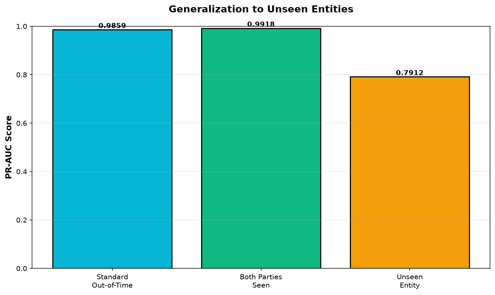

# Unseen-Entity Generalization

## Question

The main results show PR-AUC jumping from 0.0898 (transaction features only) to
0.9435 once network features (lifetime counts, degree, counterparty HHI) are
added. That's a large amount of signal riding on account history. This asks a
narrower question than the standard out-of-time test:

Does performance hold when the sender or receiver was never observed during
training, or is it propped up by history that only exists for accounts the
model has already seen?

## Method

No retraining. Reuses the artifact from the standard temporal split and
partitions the same held-out test set (1,420,913 transactions) by whether
both parties appeared in the training window (693,879 accounts):

```bash
python scripts/unseen_entity_evaluation.py
```

## Results

| Partition | Transactions | Positives | Prevalence | PR-AUC | ROC-AUC | Recall @ 0.5% | Lift @ 0.5% |
|---|---|---|---|---|---|---|---|
| Standard out-of-time (full test set) | 1,420,913 | 1,694 | 0.119% | 0.9859 | 0.9998 | 99.29% | 198.6x |
| Both parties seen in training | 716,838 | 1,569 | 0.219% | 0.9918 | 0.9998 | 99.30% | 198.6x |
| At least one party unseen | 704,075 | 125 | 0.018% | 0.7912 | 0.9998 | 99.20% | 198.4x |



## Interpretation

PR-AUC and precision both drop sharply for the unseen-entity partition
(0.99 → 0.79, precision 0.43 → 0.035). Taken alone, that looks like the network
features fail to transfer. But three other numbers move by less than noise
across all three partitions:

- **ROC-AUC**: 0.9998 in every partition — invariant to class balance.
- **Recall @ 0.5% alert budget**: ~99.2-99.3% in every partition.
- **Lift over base rate**: ~198x in every partition.

PR-AUC's baseline is the positive prevalence itself, and the unseen-entity
partition has an 8x lower prevalence (0.018% vs 0.219%) than the seen-pair
partition. A drop in PR-AUC is exactly what a stable ranking model produces
when handed a rarer-positive subset — it is not, on its own, evidence of
degraded discrimination. Lift and ROC-AUC are the metrics that control for
prevalence, and neither moves.

**Conclusion**: within this dataset, the model's ability to rank suspicious
above non-suspicious transactions does not measurably degrade for previously
unseen accounts. The apparent collapse in PR-AUC/precision is a base-rate
artifact of the partition, not a generalization failure.

The lower prevalence itself is worth noting as a property of SAML-D rather
than of the model: its suspicious typologies (structuring, layering,
fan-in/out rings) are built from a recurring cast of actors, so a genuinely
cold-start account is simply less likely to be labeled suspicious in this
synthetic dataset. That is a plausible property of real laundering rings too
(sustained actors, not one-off), but it means this test cannot fully separate
"the model doesn't know what to do with new accounts" from "new accounts are
inherently rarer positives here."

## What this doesn't test

Network features (out-degree, counterparty HHI) are computed per-transaction
from each account's own prior activity, so a first-appearance account
naturally gets a short, sparse history — a realistic cold-start, not a data
leak. What it doesn't test is whether an entire *cluster* of colluding
accounts, never seen together during training, would be caught — that needs a
connected-component holdout (partition the transaction graph so related
account clusters don't span train/test) rather than an individual-account
holdout. Left as a further extension.
